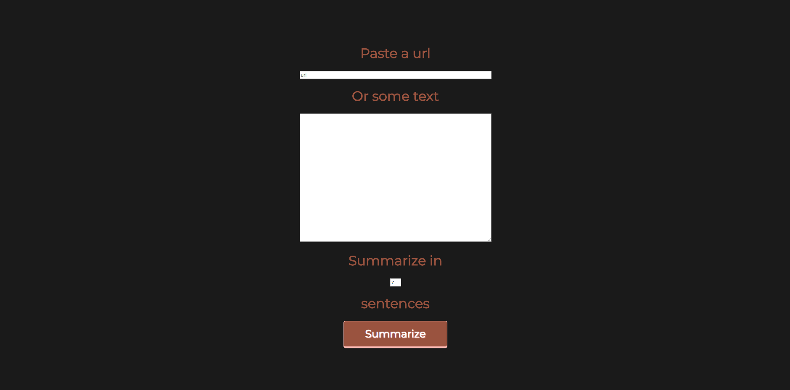

# Article Summarizer with React & Python

## [Live Site](http://summry.me)

`pip3 install -r req.txt`

<!-- installs beautifulsoup4 flask nltk requests -->

`cd src`

`python3 test.py`
(now python script is accessible at http://127.0.0.1:5000/ for ajax GET request)

`yarn`

`yarn start`

### Main Window

### Example Output

